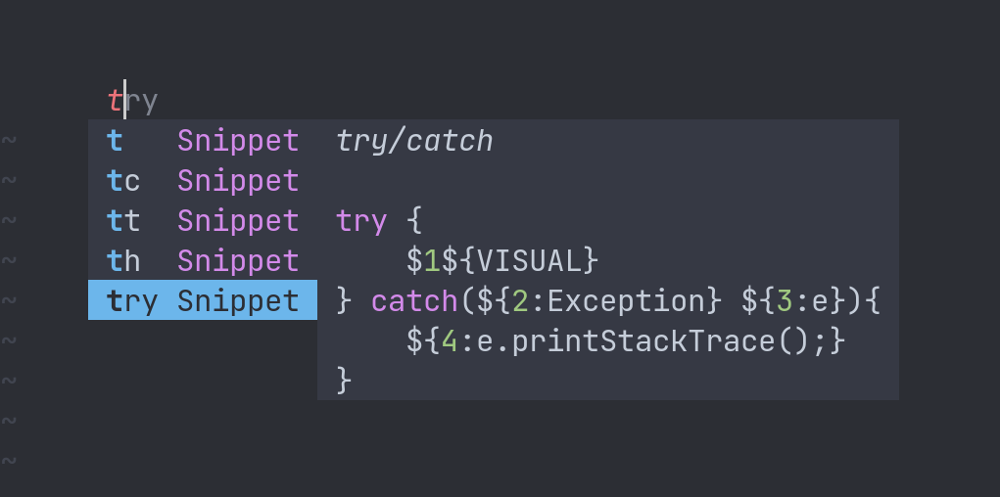

# cmp-nvim-ultisnips

<p align="center">
  <a href="https://github.com/SirVer/ultisnips">UltiSnips</a> completion source for <a href="https://github.com/hrsh7th/nvim-cmp">nvim-cmp</a>
</p>

<p align="center">
  
</p>

## Installation and Recommended Mappings

Check out the [Mappings](#Mappings) section if you want to define your own mappings.

```lua
use({
  "hrsh7th/nvim-cmp",
  requires = {
    "quangnguyen30192/cmp-nvim-ultisnips",
    config = function()
      -- optional call to setup (see customization section)
      require("cmp_nvim_ultisnips").setup{}
    end
  },
  config = function()
    local cmp_ultisnips_mappings = require("cmp_nvim_ultisnips.mappings")
    require("cmp").setup({
      snippet = {
        expand = function(args)
          vim.fn["UltiSnips#Anon"](args.body)
        end,
      },
      sources = {
        { name = "ultisnips" },
        -- more sources
      },
      -- recommended configuration for <Tab> people:
      mapping = {
        ["<Tab>"] = cmp.mapping(
          function(fallback)
            cmp_ultisnips_mappings.expand_or_jump_forwards(fallback)
          end,
          { "i", "s", [[ "c" (to enable the mapping in command mode) ]] }
        ),
        ["<S-Tab>"] = cmp.mapping(
          function(fallback)
            cmp_ultisnips_mappings.jump_backwards(fallback)
          end,
          { "i", "s", [[ "c" (to enable the mapping in command mode) ]] }
        ),
      },
    })
  end,
})
```

## Mappings

You can compose your own mappings that are comprised of the following actions:
- `expand`: expands the current snippet if the completion window is closed
- `jump_forwards` / `jump_backwards`: jumps to the next / previous snippet tabstop
- `select_next_item` / `select_prev_item`: selects the next / previous completion item

The recommended mappings use the `compose` function under the hood:
```lua
function M.expand_or_jump_forwards(fallback)
  M.compose({ "expand", "jump_forwards", "select_next_item" })(fallback)
end

function M.jump_backwards(fallback)
  M.compose({ "jump_backwards", "select_prev_item" })(fallback)
end
```

For example, if you prefer a separate key for jumping between snippet tabstops you can do
the following:


```lua
local cmp_ultisnips_mappings = require("cmp_nvim_ultisnips.mappings")
-- In your cmp setup:
...
mapping = {
  ["<Tab>"] = cmp.mapping(
    function(fallback)
      cmp_ultisnips_mappings.compose({ "expand", "select_next_item" })(fallback)
    end,
    ...
```

These actions are implemented as a table `{ condition = ..., command = ... }`.
If the condition for an action fails, the next action (in the order as the action keys are passed to `compose`) is tried until the first condition matches.
Then the `command` function is run. If none match, `fallback` is called.

## Customization

### Available Options

`show_snippets: "expandable" | "all"`

If set to `"expandable"`, only those snippets currently expandable by UltiSnips will be
shown. The snippets will always be in sync with the currently available UltiSnips snippets.

`"all"` will show all snippets for the current filetype. If using this option, be aware
that all snippets for the current buffer will be cached (even if the snippet definitions
changed). You can then manually reload the snippets with the command `:CmpUltisnipsReloadSnippets`
or by using an autocommand:

```vim
autocmd BufWritePost *.snippets :CmpUltisnipsReloadSnippets
```

Expression snippets (option `r`) and custom context snippets (option `e`) are never shown.

**Default:** `"expandable"`

---

`documentation(snippet: {}): function`

`snippet` is a table that contains the following keys (each value is a string):
- trigger, description, options, value

**Returns:** a string that is shown by cmp in the documentation window.
If an empty string (`""`) is returned, the documentation window will not appear for that snippet.

**Default:** `require("cmp_nvim_ultisnips.snippets").documentation`

By default, this shows the snippet description at the top of the documentation window
followed by the snippet content (see screenshot at the top of the readme).

### Example Configuration

Note: calling the setup function is only required if you wish to customize this plugin.

```lua
require("cmp_nvim_ultisnips").setup {
  show_snippets = "all",
  documentation = function(snippet)
    return snippet.description
  end
}
```

## Credit
[Compe source for UltiSnips](https://github.com/hrsh7th/nvim-compe/blob/master/lua/compe_ultisnips/init.lua)

## Known Issues

UltiSnips was auto-removing tab mappings for select mode, that way it was not possible to jump through snippet stops.
We have to disable this by setting `UltiSnipsRemoveSelectModeMappings = 0` (Credit [JoseConseco](https://github.com/quangnguyen30192/cmp-nvim-ultisnips/issues/5))
```lua
use({
  "SirVer/ultisnips",
  requires = "honza/vim-snippets",
  config = function()
    vim.g.UltiSnipsRemoveSelectModeMappings = 0
  end,
})
```